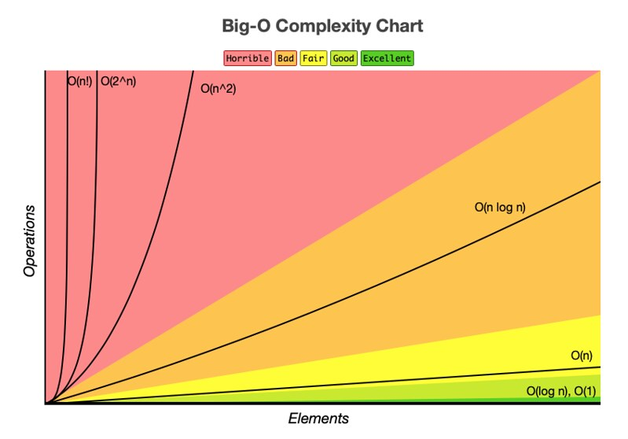

# 2.1.2 HotelDuoc
Ejercicio para trabajar colecciones y complejidades logarítmicas.

## 📊 Complejidades Logarítmicas
Las complejidades algorítmicas miden cuánto crece el tiempo de ejecución o uso de memoria de un algoritmo según aumenta el tamaño de la entrada n.

Se suelen expresar con Notación Big-O.

## ⚡ O(1) — Tiempo Constante

El algoritmo siempre tarda lo mismo, independiente de n.

```java
public void obtenerPrimerElemento(List<String> lista) {
    if (!lista.isEmpty()) {
        System.out.println(lista.get(0)); // acceso directo
    }
}
```

## 📈 O(n) — Tiempo Lineal

El tiempo crece proporcionalmente al número de elementos.

``` java
public void imprimirTodos(List<String> lista) {
    for (String elemento : lista) {
        System.out.println(elemento);
    }
}
```

## 🔁 O(n²) — Tiempo Cuadrático

Se usan bucles anidados. Útil para explicar por qué ciertas soluciones no escalan bien.

```java
public void paresPosibles(List<String> lista) {
    for (int i = 0; i < lista.size(); i++) {
        for (int j = 0; j < lista.size(); j++) {
            System.out.println(lista.get(i) + " - " + lista.get(j));
        }
    }
}
```

## 🧭 O(log n) — Tiempo Logarítmico

Se reduce el problema a la mitad en cada paso, como en búsqueda binaria.

```java
public boolean busquedaBinaria(int[] arr, int target) {
    int inicio = 0, fin = arr.length - 1;
    while (inicio <= fin) {
        int medio = (inicio + fin) / 2;
        if (arr[medio] == target) return true;
        if (arr[medio] < target) inicio = medio + 1;
        else fin = medio - 1;
    }
    return false;
}
```

## ⚖️ O(n log n) — Tiempo Log-Lineal

Común en algoritmos de ordenamiento eficientes como MergeSort o QuickSort.

import java.util.Arrays;

public void ordenar(int[] arr) {
    Arrays.sort(arr); // implementación O(n log n)
}

## 🚀 O(2ⁿ) — Exponencial

Cada incremento de n duplica el tiempo. Muy costoso.

```java
public int fibonacci(int n) {
    if (n <= 1) return n;
    return fibonacci(n - 1) + fibonacci(n - 2); // llamadas recursivas
}
```

## ✅ Resumen

O(1) → constante

O(log n) → logarítmica

O(n) → lineal

O(n log n) → log-lineal

O(n²) → cuadrática

O(2ⁿ) → exponencial

